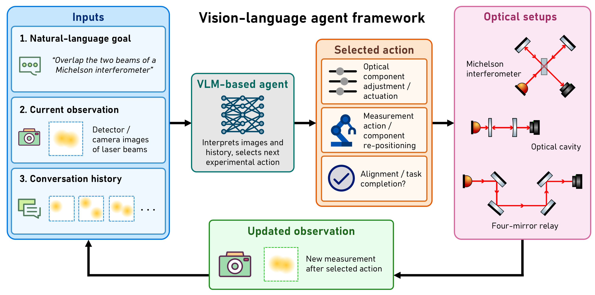
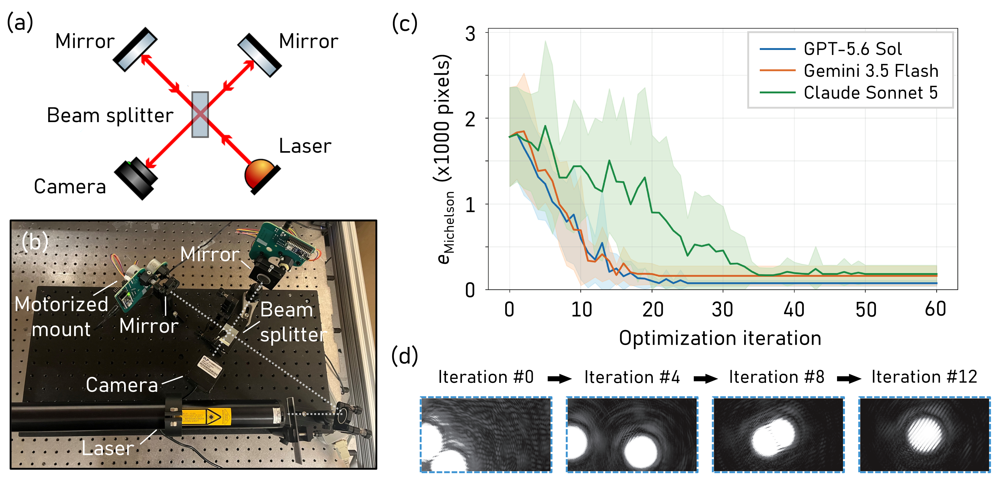
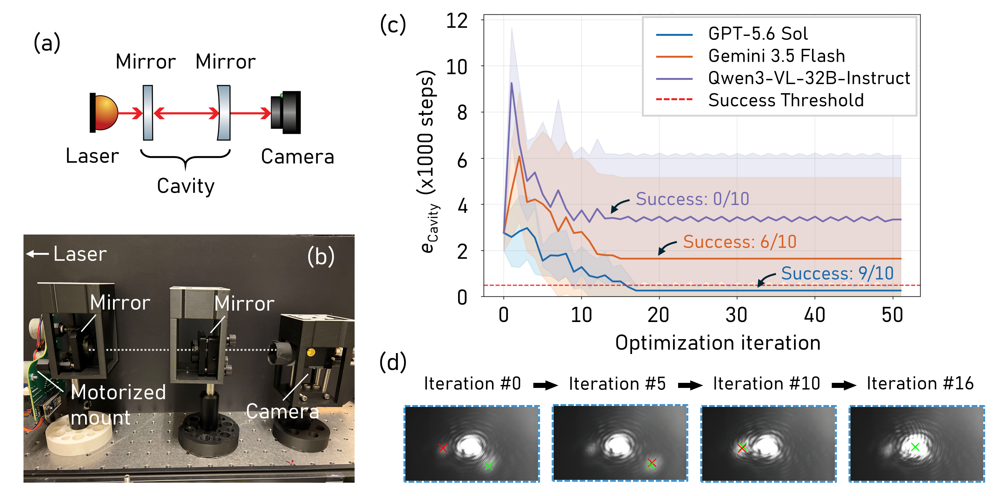
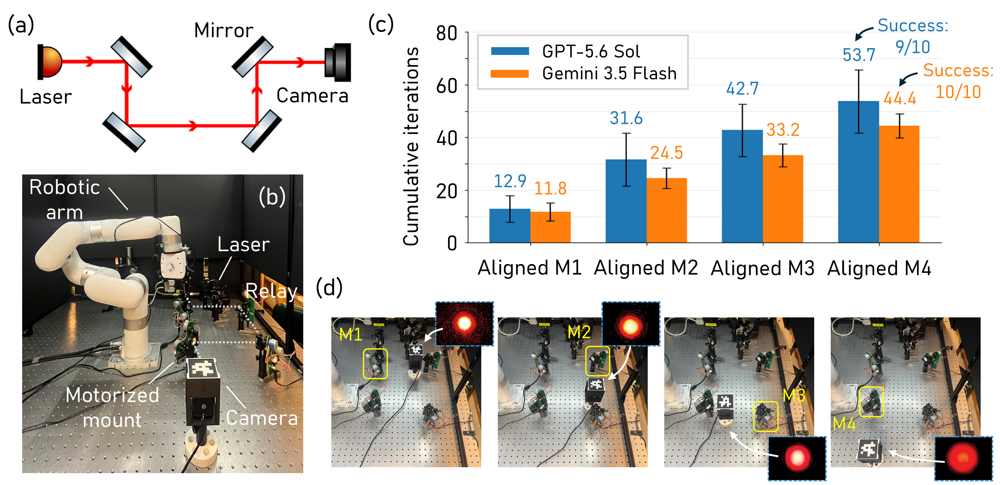
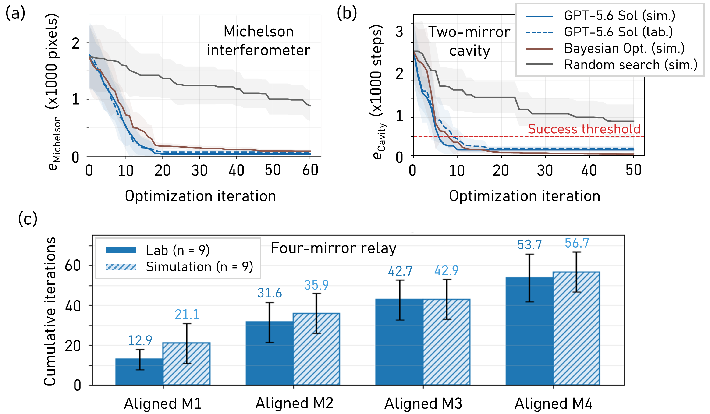

# Vision-Language Agents for Active Perception in Optics Laboratories

This repository accompanies the paper **“Vision-Language Agents for Active
Perception in Optics Laboratories.”** We study whether multimodal
language models can align optical systems directly from camera observations by
iteratively selecting motor commands and, when necessary, choosing where to make
the next measurement.

The paper evaluates this approach on a Michelson interferometer, a two-mirror
optical cavity, and a four-mirror relay. Experiments are performed in the
laboratory and in matched simulations, with Bayesian optimization and random
search included as numerical baselines.

## Quick setup

```bash
mamba env create -f environment.yml
mamba activate llm-optics-alignment
```

The alignment commands below can make paid OpenRouter calls. Laboratory commands
also move real hardware and require the appropriate drivers, calibration files,
controller addresses, and safety checks. Review each configuration before use.

## Vision-language agent framework

The agent receives a natural-language alignment goal, the latest camera image,
and the conversation history. It interprets the observation and selects the next
experimental action: adjusting an optical component, repositioning the detector,
or declaring the task complete. The resulting measurement is returned to the
agent and the loop continues.



The three optical systems below use the same general observation-and-action loop,
with experiment-specific prompts and action spaces.

## Michelson interferometer

The Michelson experiment controls four motorized mirror axes and uses the two
beam positions in the camera image as feedback. Alignment error is the sum of the
two beam-center distances from the image center. Figure 2 shows the optical
layout, laboratory apparatus, optimization trajectories, and representative
camera observations during alignment.



Here is a video showing example alignment by GPT-5.6 Sol of a Michelson interferometer.

[Watch the Michelson interferometer alignment video](paper_movies/readme/michelson_interferometer_movie.mp4)

[Full-resolution version](paper_movies/README.md#michelson-interferometer)

- **Prompt:** [`src/prompts/michelson_interferometer.txt`](src/prompts/michelson_interferometer.txt)
- **Laboratory configuration:** [`configs/mi_real/llm_runs.yaml`](configs/mi_real/llm_runs.yaml)
- **Simulation comparison:** [`configs/michelson_interferometer/compare_methods.yaml`](configs/michelson_interferometer/compare_methods.yaml)

Run the laboratory alignment:

```bash
python -m src.cli.main run --config configs/mi_real/llm_runs.yaml
```

Run the matched simulation and numerical baselines:

```bash
python -m src.cli.main run --config configs/michelson_interferometer/compare_methods.yaml
```

## Two-mirror optical cavity

The cavity experiment controls two mirror axes to overlap a movable beam with a
fixed reference beam. Performance is measured by the Euclidean motor-step
distance from the aligned origin. Figure 3 shows the optical layout, apparatus,
optimization performance and success rates, and example image-space convergence.



Here is a video showing example alignment by GPT-5.6 Sol of a two-mirror cavity.

[Watch the two-mirror cavity alignment video](paper_movies/readme/two_mirror_cavity_movie.mp4)

[Full-resolution version](paper_movies/README.md#two-mirror-optical-cavity)

- **Prompt:** [`src/prompts/two_mirror_cavity.txt`](src/prompts/two_mirror_cavity.txt)
- **Laboratory configuration:** [`configs/two_mirror_cavity/real_llm_runs.yaml`](configs/two_mirror_cavity/real_llm_runs.yaml)
- **Simulation comparison:** [`configs/two_mirror_cavity_simulation/compare_methods.yaml`](configs/two_mirror_cavity_simulation/compare_methods.yaml)

Run the laboratory alignment:

```bash
python -m src.cli.main run --config configs/two_mirror_cavity/real_llm_runs.yaml
```

Run the matched simulation and numerical baselines:

```bash
python -m src.cli.main run --config configs/two_mirror_cavity_simulation/compare_methods.yaml
```

## Four-mirror relay with active perception

The relay experiment combines optical alignment with active perception. The agent
can tilt any of four mirrors or move a robot-held camera among eight stations
along the beam path. Intermediate measurements let the agent localize upstream
alignment errors before verifying that the beam reaches the final camera. Figure
4 shows the relay geometry, robotic laboratory setup, cumulative alignment
milestones, and representative camera placements.



Here is a video showing example alignment by GPT-5.6 Sol of a four-mirror relay.

[Watch the four-mirror relay alignment video](paper_movies/readme/four_mirror_relay_movie.mp4)

[Full-resolution version](paper_movies/README.md#four-mirror-relay)

- **Prompt:** [`src/prompts/four_mirror_relay.txt`](src/prompts/four_mirror_relay.txt)
- **Laboratory configuration:** [`configs/motorized_mirror_relay/lab_runs.yaml`](configs/motorized_mirror_relay/lab_runs.yaml)
- **Matched simulation:** [`configs/motorized_mirror_relay/matched_lab_simulation.yaml`](configs/motorized_mirror_relay/matched_lab_simulation.yaml)
- **Laboratory guide:** [`configs/motorized_mirror_relay/LAB_README.md`](configs/motorized_mirror_relay/LAB_README.md)

Run the laboratory protocol:

```bash
python -m src.tasks.motorized_mirror_relay_staged \
  --config configs/motorized_mirror_relay/lab_runs.yaml \
  --scramble-plan configs/motorized_mirror_relay/scramble_plan_seed123.json \
  --start C8
```

Run the matched simulation:

```bash
python -m src.cli.main run \
  --config configs/motorized_mirror_relay/matched_lab_simulation.yaml
```

## Laboratory, simulation, and numerical baselines

The final figure compares GPT-5.6 SOL in the laboratory and simulation with
Bayesian optimization and random search for the Michelson interferometer and
two-mirror cavity. It also compares the four-mirror relay milestone progression
between the laboratory and matched simulation.



The compact numerical artifacts underlying the quantitative plots are stored in
[`paper_artifacts/`](paper_artifacts/). They can be checked without the original
raw run directories:

```bash
python scripts/reproduce_paper_figures.py \
  --artifact-root paper_artifacts \
  --output /tmp/reproduced-paper-figures

python scripts/test_paper_artifact_isolation.py
```

## Repository summary

- [`paper_figures/`](paper_figures/) contains the five figures shown in the paper.
- [`paper_movies/`](paper_movies/) contains one alignment movie for each experiment.
- [`configs/`](configs/README.md) contains the paper experiment configurations and hardware guides.
- [`src/prompts/`](src/prompts/) contains the three canonical agent prompts.
- [`src/`](src/README.md) contains the simulators, hardware adapters, agents, tasks, runners, and analysis code.
- [`paper_artifacts/`](paper_artifacts/) contains compact numerical data and regenerated quantitative plots.
- [`scripts/`](scripts/) contains figure-reproduction and artifact-isolation utilities.
- [`tests/`](tests/README.md) contains offline unit and mocked workflow tests.
